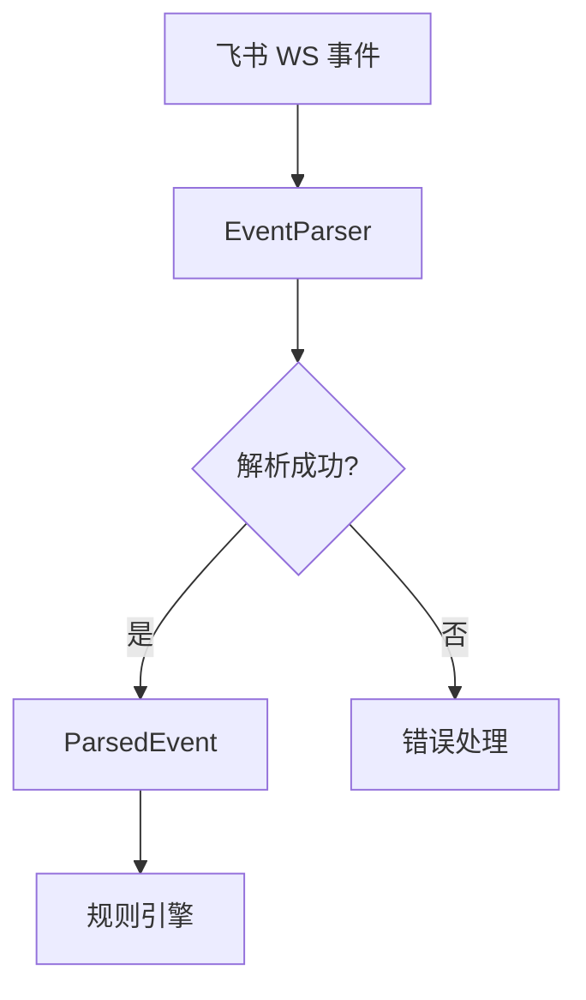
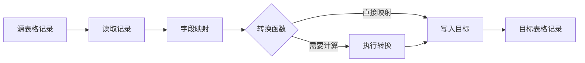

# 框架重构架构设计

## 分层架构

```
┌─────────────────────────────────────────────────────────────────┐
│                        入口层 (src/lark.ts)                     │
│  飞书 WS 事件监听                                               │
└─────────────────────────────────────────────────────────────────┘
                              ↓
┌─────────────────────────────────────────────────────────────────┐
│                      数据解析层 (src/parser/)                    │
│  - EventParser 接口                                             │
│  - FeishuEventParser（飞书事件解析）                            │
│  - FieldTypeConverter（字段类型转换）                           │
└─────────────────────────────────────────────────────────────────┘
                              ↓
┌─────────────────────────────────────────────────────────────────┐
│                      规则引擎层 (src/engine/)                    │
│  - EventRouter（事件路由）                                       │
│  - ConditionEvaluator（条件评估）                               │
│  - 支持多类型字段条件                                           │
└─────────────────────────────────────────────────────────────────┘
                              ↓
┌─────────────────────────────────────────────────────────────────┐
│                      业务执行层 (src/actions/)                   │
│  - ActionRegistry（动作注册）                                    │
│  - 动作组件（create/update/delete/query/cross-table）           │
└─────────────────────────────────────────────────────────────────┘
                              ↓
┌─────────────────────────────────────────────────────────────────┐
│                      日志层 (src/db/execution-logs.ts)           │
│  - 完整执行链路记录                                              │
│  - 每个动作独立结果                                              │
└─────────────────────────────────────────────────────────────────┘
```

## 数据流设计

### 事件解析流程



### 数据结构

#### ParsedEvent（解析后的事件）

```typescript
interface ParsedEvent {
  eventId: string              // 事件唯一 ID（用于去重）
  eventType: EventType         // 事件类型
  appToken: string             // 多维表格 Token
  tableId: string              // 数据表 ID
  recordId: string             // 记录 ID
  operatorOpenId: string       // 操作人 Open ID
  fields: FieldValues          // 变更后字段值
  beforeFields: FieldValues    // 变更前字段值
  timestamp: number            // 事件时间戳
}

type EventType = 
  | 'record_created'   // 创建记录
  | 'record_updated'   // 更新记录
  | 'record_deleted'   // 删除记录
```

#### FieldValues（字段值）

```typescript
interface FieldValues {
  [fieldId: string]: FieldValue
}

type FieldValue = 
  | string             // 文本、单选
  | number             // 数字
  | boolean            // 复选框
  | string[]           // 多选、人员列表
  | { id: string }[]   // 关联表
  | null               // 空值
```

## 接口定义

### EventParser 接口

```typescript
interface EventParser {
  // 支持的事件类型
  readonly eventTypes: EventType[]
  
  // 解析飞书原始事件
  parse(rawEvent: any): ParsedEvent
  
  // 验证事件格式
  validate(rawEvent: any): boolean
}
```

### ConditionEvaluator 增强

```typescript
// 字段类型处理器
interface FieldTypeHandler {
  // 支持的字段类型
  readonly fieldType: string
  
  // 评估条件
  evaluate(
    fieldValue: unknown,
    conditionValue: unknown,
    context: EvaluationContext
  ): boolean
}

// 所有支持的字段类型
const FIELD_TYPE_HANDLERS: Record<string, FieldTypeHandler> = {
  text: { ... },        // 文本
  number: { ... },      // 数字
  singleSelect: { ... }, // 单选
  multiSelect: { ... },  // 多选
  user: { ... },         // 人员
  date: { ... },         // 日期
  checkbox: { ... },     // 复选框
  link: { ... },         // 关联表
}
```

### ActionRegistry 增强

```typescript
interface ActionConfig {
  type: string           // 动作类型
  name: string           // 动作名称
  description: string    // 动作描述
  params: z.ZodSchema    // 参数 Schema
  execute: ActionHandler // 执行逻辑
}

interface ActionHandler {
  execute(
    params: Record<string, unknown>,
    context: ActionContext
  ): Promise<ActionResult>
}

interface ActionContext {
  recordId: string
  record: Record<string, unknown>
  beforeRecord: Record<string, unknown>
  operatorOpenId: string
  action: string
  // 新增：跨表格上下文
  crossTableResults?: Record<string, unknown>
}
```

## 字段类型映射表

### 飞书字段类型 → 内部类型

| 飞书类型 | 内部类型 | 说明 |
|----------|----------|------|
| `Text` | `text` | 文本 |
| `Number` | `number` | 数字 |
| `SingleSelect` | `singleSelect` | 单选 |
| `MultiSelect` | `multiSelect` | 多选 |
| `User` | `user` | 人员 |
| `DateTime` | `date` | 日期 |
| `Checkbox` | `checkbox` | 复选框 |
| `Link` | `link` | 关联表 |
| `Formula` | 根据公式结果类型 | 公式 |

### 字段类型转换器

```typescript
class FieldTypeConverter {
  // 飞书格式 → 内部格式
  static toInternal(feishuValue: any, fieldType: string): FieldValue {
    switch (fieldType) {
      case 'User':
        return this.convertUser(feishuValue)
      case 'MultiSelect':
        return this.convertMultiSelect(feishuValue)
      case 'Link':
        return this.convertLink(feishuValue)
      default:
        return feishuValue
    }
  }
  
  // 内部格式 → 飞书格式
  static toFeishu(internalValue: FieldValue, fieldType: string): any {
    // 反向转换逻辑
  }
}
```

## 日志结构

### ExecutionLog（增强版）

```typescript
interface ExecutionLog {
  // 基础信息
  id: string
  rule_id: string
  rule_name: string
  rule_version: number      // 新增：规则版本
  trigger_action: string
  record_id: string
  operator_openid: string
  
  // 完整快照
  fields: Record<string, unknown>
  beforeFields: Record<string, unknown>
  
  // 动作执行详情（新增）
  actions: ActionExecution[]
  
  // 汇总信息
  status: 'success' | 'partial' | 'failed'
  totalDurationMs: number
  
  // 时间
  created_at: string
}

interface ActionExecution {
  name: string             // 动作名称
  type: string             // 动作类型
  params: Record<string, unknown>  // 执行参数
  status: 'success' | 'failed'     // 执行状态
  error?: string           // 错误信息
  durationMs: number       // 执行耗时
  response?: Record<string, unknown>  // 响应数据
}
```

## 跨表格操作设计

### CrossTableAction

```typescript
interface CrossTableParams {
  // 源表格配置
  sourceAppToken: string
  sourceTableId: string
  sourceRecordId?: string
  
  // 目标表格配置
  targetAppToken: string
  targetTableId: string
  
  // 字段映射
  fieldMappings: Array<{
    sourceField: string      // 源字段
    targetField: string      // 目标字段
    transform?: string       // 转换函数
  }>
  
  // 条件（可选）
  filter?: Condition
}

interface CrossTableResult {
  success: boolean
  sourceRecord?: Record<string, unknown>
  targetRecordId?: string
  error?: string
}
```

### 数据流



## 目录结构

```
src/
├── index.ts              # 应用入口
├── lark.ts               # 飞书 WS 监听（简化）
├── parser/               # 数据解析层（新增）
│   ├── index.ts          # 接口定义
│   ├── feishu-parser.ts  # 飞书事件解析器
│   └── field-converter.ts # 字段类型转换器
├── engine/               # 规则引擎层
│   ├── index.ts
│   ├── event-router.ts
│   └── condition-evaluator.ts  # 增强版
├── actions/              # 业务执行层
│   ├── index.ts
│   ├── registry.ts
│   ├── create-record.ts
│   ├── update-record.ts
│   ├── delete-record.ts
│   ├── query-record.ts   # 新增：查询记录
│   └── cross-table.ts    # 新增：跨表格操作
└── db/                   # 数据层
    ├── client.ts
    ├── bitables.ts
    ├── rules.ts
    └── execution-logs.ts  # 增强版日志
```

## 依赖关系

```
parser/ ──────────────────────┐
    │                         │
    ↓                         ↓
engine/ ──────────────────────┤
    │                         │
    ↓                         ↓
actions/ ──────────────────────┤
    │                         │
    ↓                         ↓
db/execution-logs.ts ←─────────┘
```
